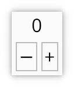

# Counter part 1: derive(Widget) and layout



Graphical User Interfaces have two main concerns:

1.  Presenting information visually
2.  Handling user input

In this tutorial we use a very simple "app" (a counter) to introduce KAS's
approach to these topics, in two parts:

1.  Introduction to layout with custom widgets
2.  Event handling with messages

## Layout with derive(Widget)

To make a counter, we need two widgets: a button and a label.

How do we put two widgets next to each other? With another widget!

KAS does not provide a "pair" or "tuple" widget. There is a `List` widget,
and we *could* box our button and label and push both into a list, but this
doesn't work well with event handling. Instead, we'll build a custom widget
(the tedious way — the next example will introduce some syntactic sugar to
make custom widgets more convenient, but here we start with the basics).

### Implementing Widget

[`Widget`] is "just" a trait, but it is better to think of it as a family of
traits, since all widgets must implement [`WidgetCore`], [`WidgetChildren`],
[`Layout`], [`WidgetConfig`], [`event::Handler`], [`event::SendEvent`] and
finally [`Widget`].

It is not recommended, or even supported, to implement all these traits
explicitly. Instead, the `derive(Widget)` macro must be used, as in this example:

```rust
use kas::event::VoidMsg;
use kas::macros::Widget;
use kas::widget::{Label, TextButton};

#[derive(Debug, Widget)]
#[layout(column)]
struct Counter {
    #[widget_core]
    core: kas::CoreData,

    #[layout_data]
    layout_data: <Self as kas::LayoutData>::Data,

    #[widget(halign = centre)]
    display: Label<String>,

    #[widget]
    button: TextButton<VoidMsg>,

    counter: u32,
}

impl Counter {
    fn new() -> Counter {
        Counter {
            core: Default::default(),
            layout_data: Default::default(),
            display: Label::new("0".to_string()),
            button: TextButton::new("&count"),
            counter: 0,
        }
    }
}
```

### derive(Debug, Widget)

The standard library defines `derive(Debug)` for us. In contrast, we must bring
the `derive(Widget)` macro into scope with `use kas::macros::Widget` (or
use `derive(kas::macros::Widget)`).

Further, since widgets are complex things, we must configure what
`derive(Widget)` does. The macro supports several attributes: `#[layout]`,
`#[widget]`, and more, configuring how the various widget traits are implemeted
(or opting out of derived implementations for some traits).

#### Core

First off, all widgets require a `CoreData` field. This field can have any name
but must have type `kas::CoreData`, and must be identified with
`#[widget_core]`. We construct it with [`Default::default`].

This field is required to implement [`WidgetCore`].

#### Child widgets

`Counter` also contains our two (child) widgets, `display` and `button`, both
annotated with `#[widget]`. The `#[widget]`
attribute is required to ensure the widgets get enumerated ([`WidgetChildren`]),
configured, added to the layout ([`Layout`]) and sent events ([`event::SendEvent`]).

Child widgets may be of any type implementing the [`Widget`] trait, though as
we'll see later, message types must also be compatible if the child's messages
are not explicitly handled.

#### Layout

For a vertical layout, we "just" declare `#[layout(column)]` and list the child
widgets in order. The macro generates the layout code for us, and we're done...

... except that the layout code also needs data storage. For that, we provide a
field annotated with `#[layout_data]` with type
`<Self as kas::LayoutData>::Data`.

A few other layouts are supported:

-   `single` (one widget only)
-   `col`, `column`, `down`: all equivalent
-   `row`, `right`: horizontal layout
-   `up`, `left`: reversed column/row
-   `grid`: two-dimensional layout (we'll use this for the next example)

#### Alignment hints

You may have noticed `#[widget(halign = centre)]` above. The `#[widget]`
attribute has a few optional parameters: `halign` and `valign` for alignment,
`col` and `row` for `grid` positioning, and a couple more.

These alignment parameters are *hints*: they construct an [`AlignHints`] object
which is passed to the widget's layout code. It is up to the widget what to do
with the hint; for a `Label` it affects text-flow; some other widgets reposition
themselves within the available space; some others simply fill all available
space.

Available values:

-   `default`: usually left/top alignment, but for text it depends on the script
    direction (e.g. Arabic will be right-aligned)
-   `left` or `top` (depending on orientation)
-   `right` or `bottom`
-   `centre` (or `center`, for those who prefer US English)
-   `stretch`: fill space (e.g. justified text)


[`AlignHints`]: https://docs.rs/kas/latest/kas/layout/struct.AlignHints.html
[`Default::default`]: https://doc.rust-lang.org/nightly/std/default/trait.Default.html#tymethod.default
[`Widget`]: https://docs.rs/kas/latest/kas/trait.Widget.html
[`WidgetCore`]: https://docs.rs/kas/latest/kas/trait.WidgetCore.html
[`event::Handler`]: https://docs.rs/kas/latest/kas/event/trait.Handler.html
[`event::SendEvent`]: https://docs.rs/kas/latest/kas/event/trait.SendEvent.html
[`Layout`]: https://docs.rs/kas/latest/kas/trait.Layout.html
[`WidgetChildren`]: https://docs.rs/kas/latest/kas/trait.WidgetChildren.html
[`WidgetConfig`]: https://docs.rs/kas/latest/kas/trait.WidgetConfig.html
